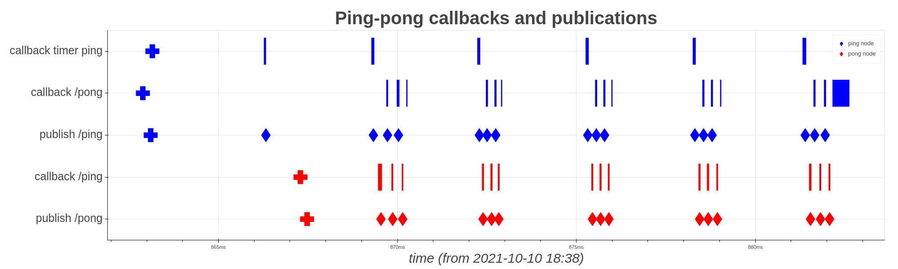
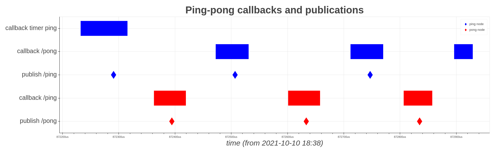

# ros-world-2021-demo

Demo for ROS World 2021 talk: *Tracing ROS 2 with ros2_tracing*.

## Demo

In the demo, we trace a [ping](./ros_world_2021_demo/src/ping.cpp) node and a [pong](./ros_world_2021_demo/src/pong.cpp) node.
See [launch file](./ros_world_2021_demo/launch/demo.launch.py).
The nodes exchange N messages (*ping* then *pong*) every M milliseconds T times, and then exit.
The ping node publishes its *pings* on the `/ping` topic and the pong node publishes its *pongs* on the `/pong` topic, with each node subscribing to the other's messages.
We trace the nodes and analyze the trace data using a [Jupyter notebook](./ros_world_2021_demo/analysis/demo.ipynb) to show timer & subscription callbacks, publications, and timer & subscriptions & publisher creations over time.

## Instructions

1. Setup system to build ROS 2 Rolling and trace
    * https://docs.ros.org/en/rolling/Installation/Ubuntu-Development-Setup.html
    * https://gitlab.com/ros-tracing/ros2_tracing
1. Clone `tracetools_analysis` and this repo, and install dependencies
    ```sh
    cd ws/src
    git clone https://gitlab.com/ros-tracing/tracetools_analysis.git
    git clone https://github.com/christophebedard/ros-world-2021-demo.git
    cd ..
    pip3 install notebook bokeh
    ```
1. Build
    ```sh
    colcon build --packages-up-to ros_world_2021_demo
    ```
1. Source and launch
    ```sh
    source install/setup.bash
    ros2 launch ros_world_2021_demo demo.launch.py
    ```
    * it should exit by itself
    * alternatively, instead of executing the launch file, use the sample trace by extracting the contents of [`trace.zip`](./trace.zip) into your `~/.ros/tracing/` directory
1. Analyze
    ```sh
    pip3 install notebook bokeh
    jupyter notebook src/ros-world-2021-demo/ros_world_2021_demo/analysis/demo.ipynb
    ```
    * run the whole notebook

## Results

Overall results:

<p align="center">
   <a href="./plot_overall.png"></a>
</p>

Single ping-pong sequence:

<p align="center">
   <a href="./plot_single_sequence.png"></a>
</p>
